---
---

# 工具链配置指南

本文档介绍 STM32 嵌入式开发所需的工具链安装与配置方法，尽量让新手简单配置好环境。

---

## 一、工具概览

这些工具链比较杂，建议了解每个工具的用途，这样可以自己解决问题。

| 工具                           | 用途                      | 推荐安装途径         |
| ------------------------------ | ------------------------- | -------------------- |
| msys2                          | 包管理器，提供 mingw 环境 | 官网下载             |
| mingw-w64-x86_64-toolchain     | C 编译器、mingw32-make    | msys2 包管理器       |
| mingw-w64-x86_64-arm-none-eabi | ARM 交叉编译工具链        | **ARM 官网**（推荐） |
| mingw-w64-x86_64-ccache        | 编译缓存，加速编译        | msys2 包管理器       |
| mingw-w64-x86_64-openocd       | 调试下载工具              | msys2 包管理器       |

> **注意**：不建议用 msys2 安装 `mingw-w64-x86_64-arm-none-eabi`，因为缺少 `arm-none-eabi-gdb.exe`。

---

## 二、安装 VSCode 插件

### C 语言开发插件

1. **Better C++ Syntax**  
   

2. **C/C++ Extension Pack**  
   

3. **C/C++ Snippets**  
   

4. **Makefile Tools**  
   

### 调试插件

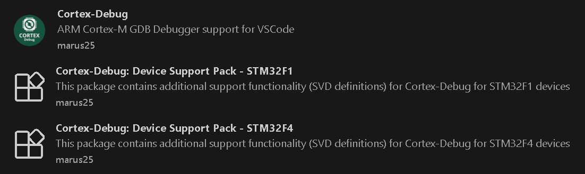

1. Cortex-Debug
2. Cortex-Debug: Device Support Pack - STM32F1
3. Cortex-Debug: Device Support Pack - STM32F4

---

## 三、安装工具链

### 3.1 下载 msys2

从以下任一途径下载 msys2 安装包：

**方法一：官网**

[msys2 官网](https://www.msys2.org/) 中选择最新版本下载  
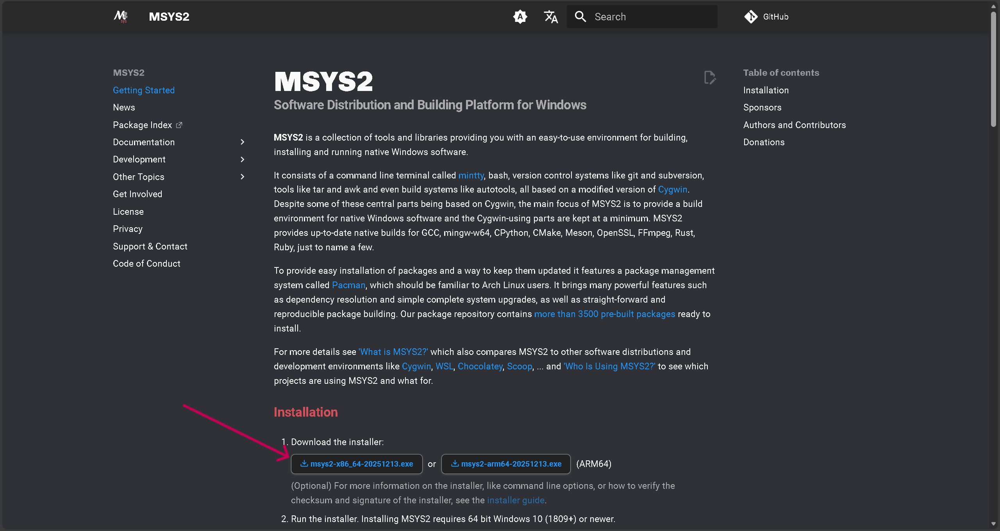

**方法二：清华镜像**

[清华镜像](https://mirrors.tuna.tsinghua.edu.cn/msys2/distrib/x86_64/) 中选择 `msys2-x86_64-最新日期.exe`  
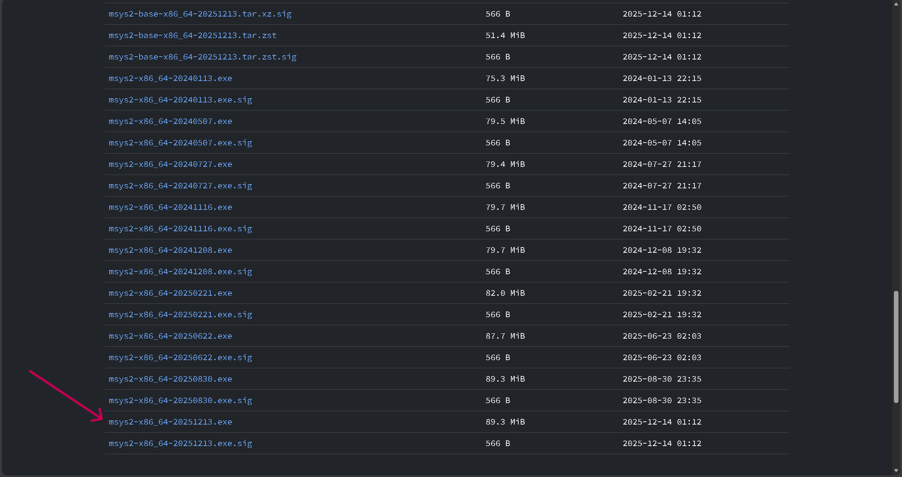

**方法三：我的 Gitee 仓库**

[我的 Gitee 仓库](https://gitee.com/trwwrt/download_toolchain)  
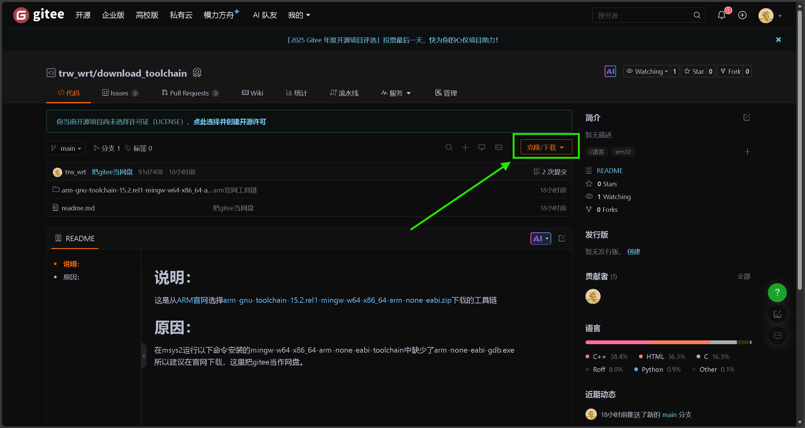  
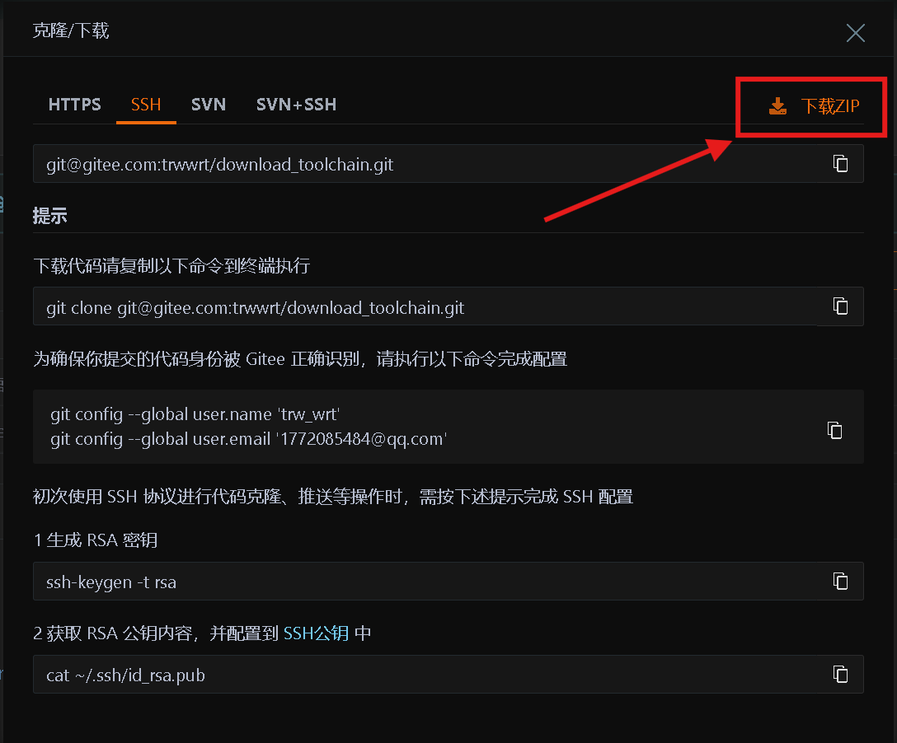

或者在 cmd 运行以下命令 clone：

```bash
git clone git@gitee.com:trwwrt/download_toolchain.git
```

### 3.2 安装 msys2 并配置工具链

1. 运行 msys2 安装包，记住安装路径，记作 `{MsysInstallPath}`
2. 运行 `{MsysInstallPath}\msys2.exe` 或 `{MsysInstallPath}\mingw64.exe`  
    

3. 在打开的终端中执行以下命令：

```bash
pacman -S mingw-w64-x86_64-toolchain \
    mingw-w64-x86_64-ccache \
    mingw-w64-x86_64-openocd
```

4. 如果出现 `Enter a selection (default=all):`，直接回车
5. 如果出现 `Proceed with installation? [Y/n]`，输入 `Y`，回车

### 3.3 安装 ARM 交叉编译工具链

**推荐从 ARM 官网下载**（msys2 版本缺少 gdb）：

1. 访问 [ARM 官网下载页](https://developer.arm.com/downloads/-/arm-gnu-toolchain-downloads)  
   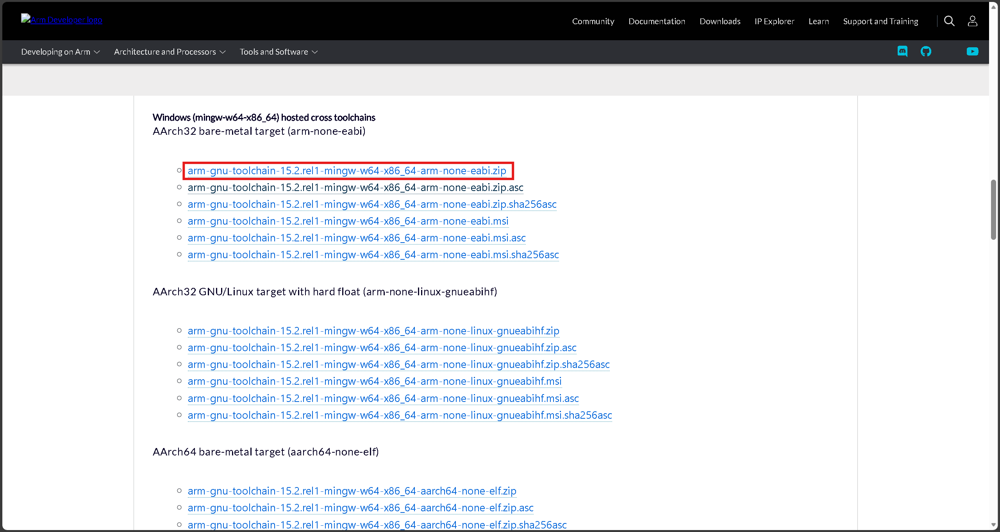

2. 选择 Windows (mingw-w64-x86_64) 版本，下载 zip 压缩包

3. 解压到合适路径，记作 `{ArmToolPath}`

> 如果官网下载太慢，可以使用 [我的 Gitee 仓库](https://gitee.com/trwwrt/download_toolchain) 备份。

---

## 四、配置环境变量

需要添加 `{MsysInstallPath}\mingw64\bin` 和 `{ArmToolPath}\bin` 两个路径到环境变量。

### 操作步骤

1. 在 Windows 搜索栏中输入"环境"，点击"编辑系统环境变量"
2. 点"环境变量"
3. 在系统环境变量中选中"Path"，点"编辑"
4. 点击"新建"，复制粘贴第一个路径，再次点击"新建"，再复制粘贴第二个路径
5. 点 3 次确定，记住一定要点 3 次确定

> 这个不会的可以参考 [keysking 的笔记](https://docs.keysking.com/docs/stm32/CLion/use/)，但不要照抄。

---

## 五、验证安装

### 5.1 打开终端

在桌面右键，点击"在终端中打开"  
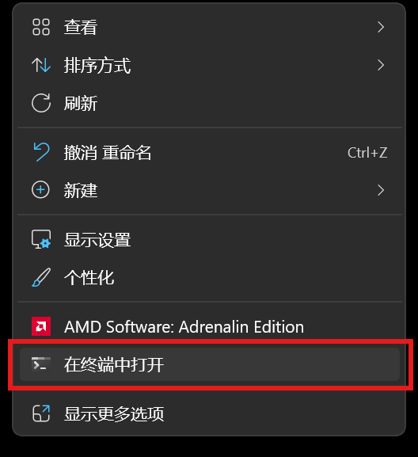

### 5.2 依次运行以下命令测试

```bash
gcc -v                    # 验证 mingw 工具链
arm-none-eabi-gcc -v      # 验证 ARM 交叉编译工具链
where ccache              # 验证 ccache 路径
openocd -v                # 验证 openocd
```

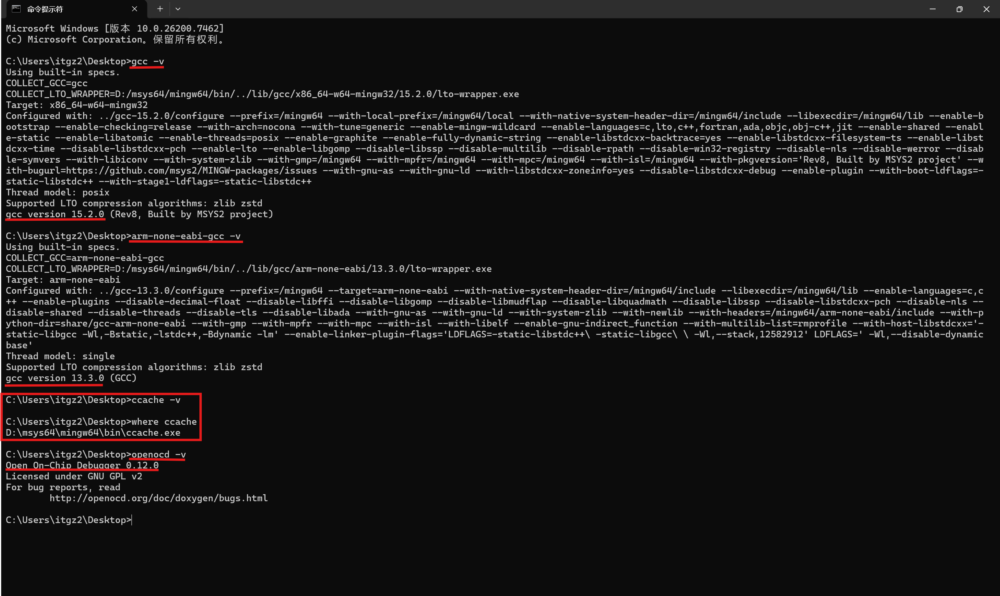

### 5.3 成功标志

- gcc 和 arm-none-eabi-gcc 显示版本号
- ccache 显示刚才添加的路径
- openocd 显示版本信息

---

## 六、配置 Makefile Tools 插件

1. 打开 VSCode 设置（`Ctrl + ,`）
2. 搜索 `Makefile: Make Path`
3. 填写为 `mingw32-make`（不需要完整路径，因为已添加到 PATH）  
   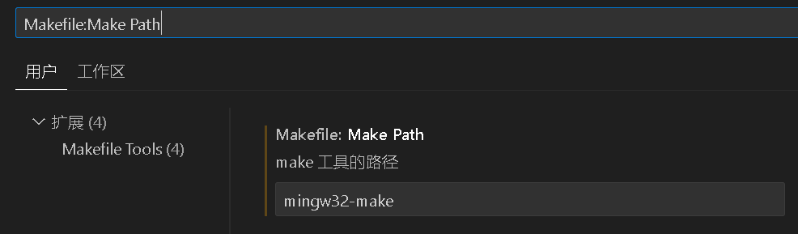

---

## 七、编译、运行与调试

### 注意事项

以下配置文件基于 **stm32f103c8t6** 芯片和项目名为"1"，使用 makefile 构建。

使用前需要选择 makefile：  
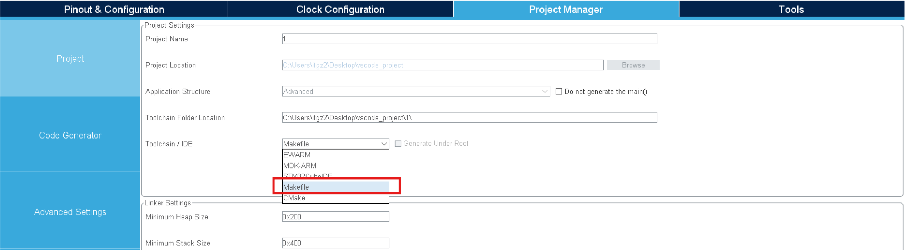

### 7.1 编译

**方法一：命令行**

在项目路径下的 cmd 或 PowerShell 运行：

```bash
mingw32-make -j4
```

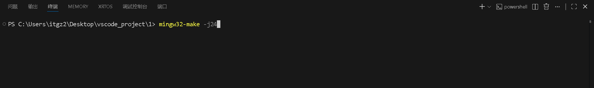

**方法二：VSCode 任务**

复制 [tasks.json](./asset/tasks.json) 到 `.vscode` 文件夹，然后在 VSCode 上边栏点击"终端" → "运行任务" → `build task`

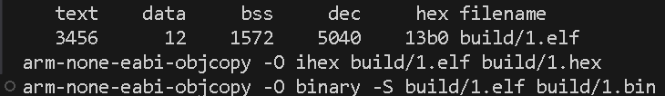

### 7.2 运行与调试

项目结构：  
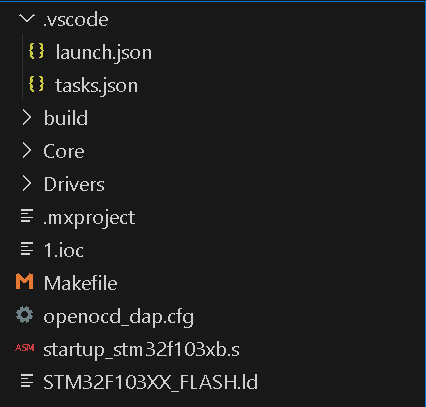

1. 复制粘贴 [launch.json](./asset/launch.json) 到 `.vscode` 文件夹
2. 复制粘贴 [openocd_dap.cfg](./asset/openocd_dap.cfg) 到**项目根目录**
3. 根据芯片型号和项目名修改这两个文件
4. 点击左边栏"运行与调试"，点击三角形开始调试

---

## 八、配置文件参考

### tasks.json

```json
{
  "version": "2.0.0",
  "tasks": [
    {
      "label": "build task",
      "type": "shell",
      "command": "mingw32-make -j24",
      "problemMatcher": [],
      "group": {
        "kind": "build",
        "isDefault": true
      }
    },
    {
      "label": "download dap",
      "type": "shell",
      "command": "mingw32-make -j24 ; mingw32-make download_dap",
      "group": {
        "kind": "build",
        "isDefault": false
      },
      "problemMatcher": []
    },
    {
      "label": "download jlink",
      "type": "shell",
      "command": "mingw32-make -j24 ; mingw32-make download_jlink",
      "group": {
        "kind": "build",
        "isDefault": false
      }
    },
    {
      "label": "log",
      "type": "shell",
      "command": "JlinkRTTClient",
      "args": [],
      "problemMatcher": []
    }
  ]
}
```

### launch.json

```json
{
  "version": "0.2.0",
  "configurations": [
    {
      "name": "DAPlink",
      "cwd": "${workspaceRoot}",
      "executable": "${workspaceRoot}\\build\\1.elf",
      "request": "launch",
      "type": "cortex-debug",
      "device": "STM32F103C8T6",
      "svdFile": "STM32F103C8T6.svd",
      "servertype": "openocd",
      "configFiles": ["openocd_dap.cfg"],
      "runToEntryPoint": "main",
      "rtos": "FreeRTOS",
      "preLaunchTask": "build task",
      "liveWatch": {
        "enabled": true,
        "samplesPerSecond": 4
      }
    },
    {
      "name": "DAP-attach",
      "cwd": "${workspaceRoot}",
      "executable": "${workspaceRoot}\\build\\1.elf",
      "request": "attach",
      "type": "cortex-debug",
      "device": "STM32F103C8T6",
      "svdFile": "STM32F103C8T6.svd",
      "servertype": "openocd",
      "configFiles": ["openocd_dap.cfg"]
    }
  ]
}
```

### openocd_dap.cfg

```bash
source [find interface/cmsis-dap.cfg]
transport select swd
source [find target/stm32f1x.cfg]
```

### c_cpp_properties.json

```json
{
  "configurations": [
    {
      "name": "Win32",
      "includePath": ["${workspaceFolder}/**"],
      "defines": ["_DEBUG", "UNICODE", "_UNICODE"],
      "cStandard": "c17",
      "cppStandard": "gnu++14",
      "intelliSenseMode": "windows-gcc-x86",
      "configurationProvider": "ms-vscode.makefile-tools"
    }
  ],
  "version": 4
}
```

---

## 九、替代方案

### 9.1 STM32CubeCLT

ST 官方提供的命令行工具集，包含 ARM 工具链：

- 下载地址：[ST 官网](https://www.st.com.cn/zh/development-tools/stm32cubeclt.html)
- 或通过 [fubemx](https://fubemx.keysking.com/) 下载

### 9.2 keysking 工具链

keysking 提供的预配置开发环境：

- 文档：[docs.keysking.com](https://docs.keysking.com/docs/stm32/CLion/use)
- 包含 ARM 工具链和 openocd

### 9.3 GitHub 下载 OpenOCD

官方仓库：

- [openocd 官方](https://github.com/openocd-org/openocd)
- [STM32 官方](https://github.com/STMicroelectronics/OpenOCD)

---

## 十、常见问题

### Q1: msys2 包管理器下载太慢？

配置国内镜像源，编辑 `{MsysInstallPath}\etc\pacman.d\mirrorlist.mingw64`，将清华镜像放在最前面：

```
Server = https://mirrors.tuna.tsinghua.edu.cn/msys2/mingw/x86_64/
```

### Q2: arm-none-eabi-gdb 缺失？

这是 msys2 版本的已知问题，请使用 ARM 官网下载的完整版本。

### Q3: 环境变量不生效？

- 确保添加的是 `mingw64\bin` 而非 `msys64\usr\bin`
- 添加后需要**重新打开终端**才能生效

---

## 参考资料

- [msys2 官网](https://www.msys2.org/)
- [ARM GNU Toolchain 下载](https://developer.arm.com/downloads/-/arm-gnu-toolchain-downloads)
- [OpenOCD 官方仓库](https://github.com/openocd-org/openocd)
- [keysking STM32 开发笔记](https://docs.keysking.com/docs/stm32/CLion/use)
